<!--
  Perfil de Mauro Andrade — todos os visuais são SVGs animados gerados por código.
  Edite o conteúdo em scripts/data.mjs e rode: node scripts/build.mjs
  A Action .github/workflows/profile.yml atualiza as estatísticas e o snake todo dia.
-->

<a href="https://mhaurinho.github.io/"></a>

  

 

  

<a href="https://www.linkedin.com/in/mauro-andrade-5a782147/"></a>

  

  

<a href="https://mhaurinho.github.io/stellar/"></a>
<a href="https://github.com/mhaurinho/litterwatch-dados-sinteticos"></a>
<a href="https://mhaurinho.github.io/#projetos"></a>
<a href="https://mhaurinho.github.io/#projetos"></a>
<a href="https://mhaurinho.github.io/#projetos"></a>
<a href="https://mhaurinho.github.io/#projetos"></a>

 


  


<picture>
  <source media="(prefers-color-scheme: dark)" srcset="https://raw.githubusercontent.com/mhaurinho/mhaurinho/output/snake-dark.svg"/>
  
</picture>

<a href="https://mhaurinho.github.io/#contato"></a>
